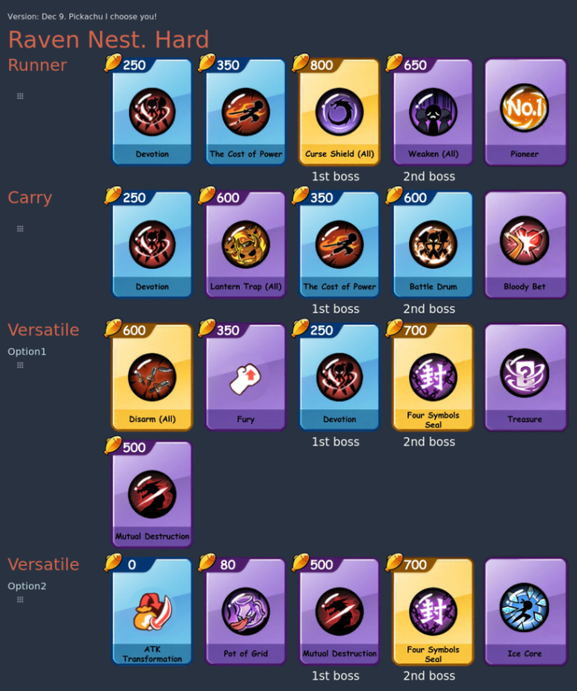

# NMD Arena Strategy Tool

Arena Strategy Tool for mobile game `Ninja Must Die` (`NMD`). Tool website: https://marniks7.github.io/nmd-arena/

Example of our usage:


### Project Status

- Tool is finished and fully usable.
- Content is NOT updated (season 3 cards and maps). Fill free to contact me if you want to support content update.

### Motivation

We wanted to improve our clan performance and to do our best to win. We came-up with the idea of the role-based approach
(`carry`, `runner`, `versatile`, etc) and to have one decent strategy (for every map). Adjustments are
always needed, so it should be possible to make the experience pleasant and fast.
Following this idea this tool was designed and created, along with the videos, tips&tricks for each role, each map.

The following options were explored before creating the tool:

- Icons in Discord - limited amount can be uploaded to the server and might not be quick enough
- https://tiermaker.com/create/ninja-must-die-weapons-16381012, but it didn't provide customizable enough solution
- In-game interface doesn't allow to save more than 3 options, and it doesn't allow to combine cards for multiple
  players

### Browsers Support

- The best performance you can expect on PC\laptop in Chrome or Firefox browser.
- On mobile `take screenshot` feature doesn't work and there could be too many rows to take the screenshot by using
  mobile built-in approach
    - In addition to that, drag&drop there doesn't have a pleasant experience

### Features

1. Click or tap on cards to add them.
   How it works: First card is added to the 3rd column and second card to the 4th column. After that to 1st and 2nd
   columns.
   The idea behind this is to have 2 main cards, one for the first boss and one for the second. The player is
   responsible for taking them.
   They are on 3rd and 4th position because of Chaos effect
2. Drag&drop cards
3. Add few cards to one column
4. Save to the browser
5. Take Screenshot
6. Add the description
7. Add rows (roles) and option (e.g. for different passives)
8. Choose map (background is colored based on the color in the game) for better identification
9. Choose map effect

### Results of the entire idea

It worked well with the motivated skilled team of 3 who were willing to put time&effort into following the strategy. It
worked well for the 1vs1 preparation.

It didn't work well with some of the teams due to different reasons:

1) No `runner` in the team or runner can't come first. This is addressed by switching the cards if the
   player comes 2nd, but not 3rd.
2) They couldn't gather enough coins. The cards were adjusted so that player could afford another card if he didn't make
   it as planned
3) They didn't want or didn't have time to practice.
4) When fighting against mega-whales first-boss debuffs couldn't help because of the low boss HP (it was changed later
   by game developers)

### Compile and Hot-Reload for Development

```sh
npm run dev
```

See [build.md](docs/build.md) for details